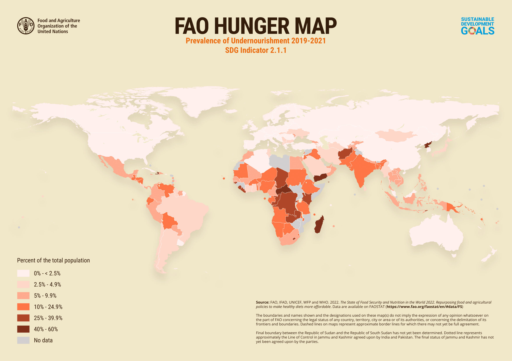
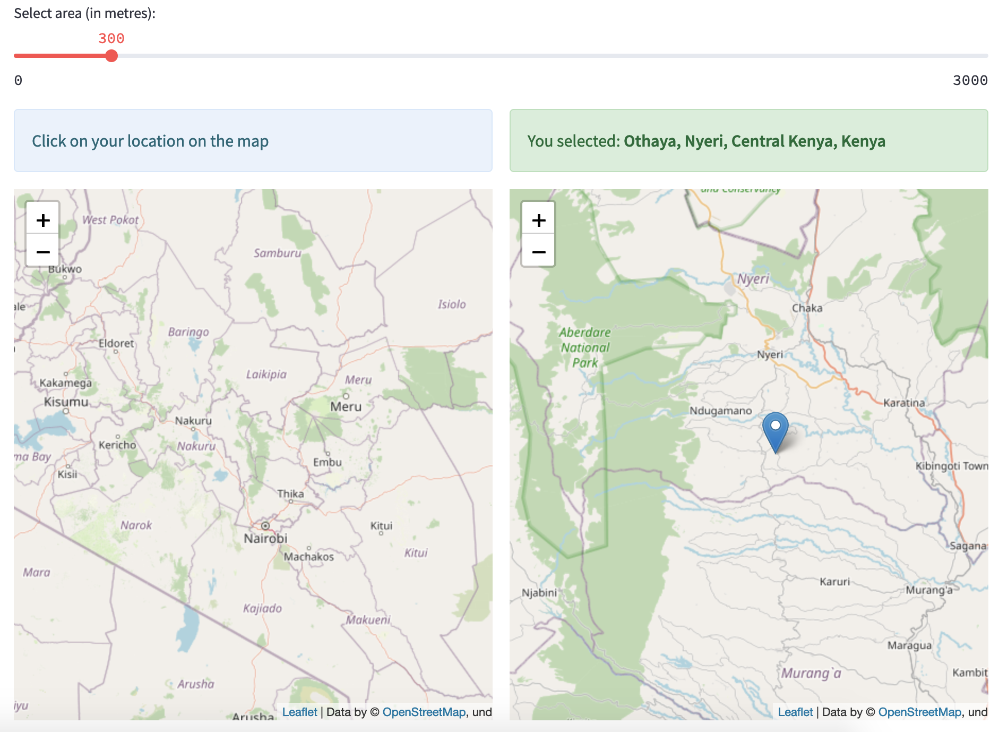
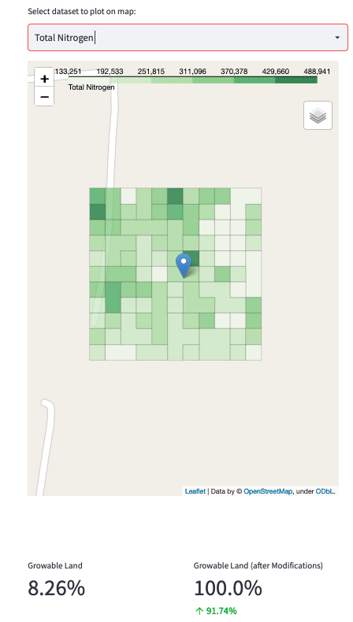
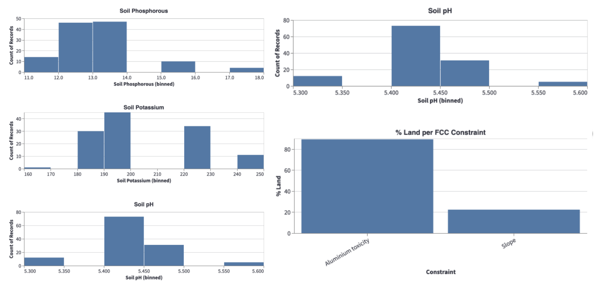
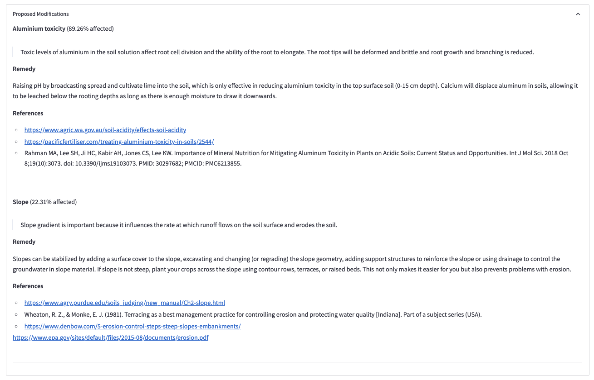
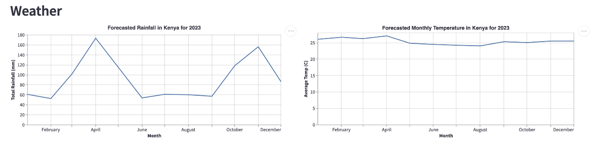
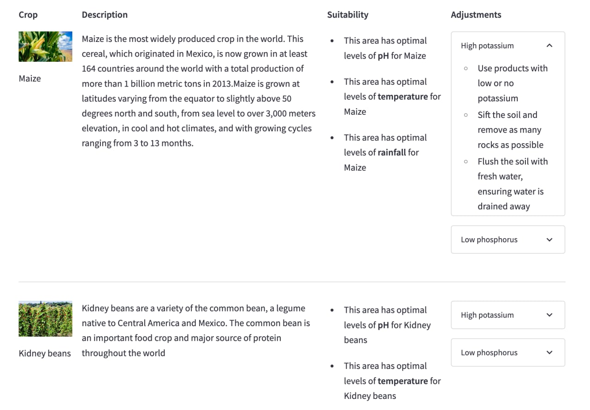
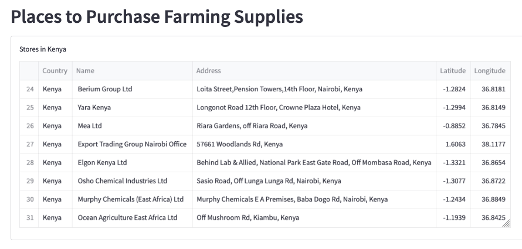

# Agri-able
A tool to help the African farming community to optimize crop production

## Abstract
Agri-able is a tool that aims to help the African farming community optimize crop production. The global demand for food greatly outstrips that for supply, and there is an urgent need for interventions to address this balance. 

Agri-able primarily leverages Amazon Sustainability Data’s iSDAsoil to help drive insights to the users. By layering the relevant datasets such as environmental attributes, soil attributes, time-series weather and crops attributes recommendations, we are able to empower users to confidently make data driven decisions on optimizing their crop planning strategies.

## Inspiration
In the next 30 years, the world population is expected to increase by 2 billion people (United Nations, n.d.), with a corresponding increase in food demand. Moreover, it was estimated that 10% of the world population suffered from hunger in 2020 (Relief Web, 2021), an increase from 8.4% in 2019. This demonstrates a booming demand for food, which isn’t being met properly. 

Figure 1 shows that the African continent is most hit by hunger, as shown by the darker colours that signifies a larger percentage of the population suffering from hunger. Hence, the target region for Agri-able is the African continent. This is further elaborated on in the “Target Users” section.

_Figure 1: FAO World Hunger Map (Food and Agriculture Organization of the United Nations, 2022)_

Climate change is one of the biggest factors that has further intensified the challenge for food security. It is estimated that food production must increase by 60% to meet the food demand by 2050 (United Nations, 2021).

With this backdrop, this project focuses on the following UN Sustainable Development Goal (“UN SDG”): **Goal 2: Zero Hunger - End hunger, achieve food security and improved nutrition and promote sustainable agriculture.** 

By leveraging on datasets from and outside Amazon Sustainability Data Initiative (ASDI), a dashboard is created to help enhance farmers' agriculture knowledge, which will lead to higher crop yield. The tool also indirectly addresses other UN SDGs:
1. **Arming farming community with knowledge to enhance crop yield**, helping populations take steps towards food security (Goal 2: Zero Hunger)
2. **Increasing income from enhanced crop yields for rural farming communities** that typically have little access to information to make farming more efficient (Goal 1: No Poverty)
3. **Tailoring the solution for the African continent.** Africa is amongst the worst hit by climate change (Adepoju, 2021), with 346 million people facing severe food insecurity, a 20% increase from 2021 (Mersie, 2022). Agri-able helps to indirectly address various inequalities such as income and food availability (Goal 10: Reduced Inequalities)

## Target Users

Agri-able targets the African continent, due to the following reasons:
1. **Africa is amongst the worst hit by food insecurity**, as seen in Figure 2 

_Figure 2: FAO Food Insecurity Map (Food and Agriculture Organization of the United Nations, 2022)_

1. **African agriculture sector is one of the least efficient**, as seen in Figure 3. Having more access to information could help them in becoming more efficient 

_Figure 3: Agriculture value added per worker (Ritchie, 2022)_

1. **Larger impact of rising food prices on lower income countries**, since a larger portion of their income is spent on food (The World Bank, 2022). Approximately 45% and 60% of total household consumption expenditure was spent on food for Uganda and Tanzania, respectively, as compared to about 15% for the US (Kavanagh, 2019). The Food and Agriculture Organization’s (FAO’S) Food Price Index rose by 55.2% between May 2020 and February 2022 (Barua, 2022). With improved crop yields from using Agri-able, it could help to lower food prices for the African community

User groups for the tool could include:
1. **Farmers**, who could access the tool fully online, without any additional investments aside from a mobile phone or computer that can access the internet
2. **African governments and agricultural ministries**, who could use the tool to better understand the existing and ideal environmental conditions for various crops, and provide necessary support to the farmers
3. **International groups** that are focussed on giving aid to the African agriculture community

## What Agri-able Does
Agri-able is a tool that is fully available online via desktop or a mobile phone, developed on Streamlit. The key features of the tool are: 
- **To recommend users with optimal crops to plant** based on the forecasts of weather and soil conditions over the next few months, as well as user’s target objectives, which include profitability, ease of planting, and least modifications to conditions
- **To provide users with practical tips on achieving optimal conditions** for enhanced crop yields

Ultimately, the tool aims to help users understand the existing conditions of their land, educate them on optimal conditions for various crops, and give them practical tips to achieve these optimal conditions. This should help to enhance crop yields in the African agriculture community, and hopefully alleviate hunger in the region.

### Location Selector
On the Settings page, the user is able to navigate and click on their desired location from the map on the left. The selected location is then reflected on the map on the right. 

_Figure 4: Location selector_ 

### Environment Information

After selecting the location, the user proceeds to the Agri-able dashboard. One of the features is a heatmap to display the existing conditions within a 30m by 30m plot based on the selected location (Figure 5). 

_Figure 5: Land condition heatmap and growable land metrics_

The darker the color, the higher the condition. The condition can be selected in the drop down above the map, and they consist of:
- Fertility Capability Classification (“FCC”)
- Total Nitrogen
- Soil Phosphorus
- Soil Potassium
- Soil pH

This heatmap helps the user identify which area is in excess or lacks a certain condition, helping the user with modifying the conditions accurately.

Beside the choropleth map, the following histograms provide the user with a high level overview of the properties of the selected plot of land. From this overview, users are able to understand the general nature and conditions of the selected land.

_Figure 6: Visualizations on land conditions_

Below the land condition heatmap, there are 2 metrics available (shown at the bottom of Figure 3):
- **Growable land**: This indicates the percentage of land in the selected area that has ideal land conditions
- **Growable land (after modifications)**: This indicates the forecasted percentage of land in the selected area that is likely to have ideal land conditions after proposed modifications are made (refer to Figure 7 below). 
	
These metrics could help users identify a plot of land that inherently already is ideal for growing crops, so as to reduce the amount of modifications required. 

From there, the dashboard shows proposed modifications that the user can make to improve the land conditions (Figure 7). References are also provided should the user require more relevant information. 

_Figure 7: Proposed modifications_

### Weather Information
Forecasted rainfall and monthly temperatures in the selected location for the next few months are also shared (Figure 8). This could help the user in planning, as different crops may require different amounts of water and temperatures.

_Figure 8: Forecasted rainfall and monthly temperature_

### Crop Recommendations
Based on the soil’s fertility and weather, a set of crops are recommended based on the  highest suitability. These recommendations aim to provide the users a narrowed down list of crops that are highly likely to grow with minimal adjustments needed. Users are able to expand on the crop-specific adjustments to get tips on how to effectively remedy them in order to enhance growing conditions.

_Figure 9: Crop recommendations and suggested adjustments_

### Places to Purchase Farming Supplies
Farmers may benefit from this feature should they want to act on the proposed modifications and adjustments. Hence, Agri-able also provides recommended farming and fertilizer suppliers that are near the selected location. 

_Figure 10: Nearby farming and fertilizer suppliers_

## Datasets Used
In building Agri-able, we used a combination of datasets from different sources and also augmented some of our own that we had built through research.

| Data                                                                                                              | Source | Link | 
|-------------------------------------------------------------------------------------------------------------------|--------|------|
| **iSDAsoil**  - Fertility Capability Classification  - Nitrogen - Phosphorus - Potassium - pH |Amazon Sustainability Data Initiative (ASDI)| https://aws.amazon.com/marketplace/pp/prodview-3bfpv6jsl4tqk|
| **Time series data for African countries**  - Monthly Temperature  - Monthly Precipitation                |World Bank Climate Change Knowledge Portal| https://climateknowledgeportal.worldbank.org/download-data |
| **Optimal Crop Attributes**  - Phosphorus - Potassium - pH  - Rainfall - Temperature          |Food and Agriculture Organizations of the United Nations| https://www.fao.org/land-water/databases-and-software/crop-information/en/ |

_Table 1: Data sources_

### Environment Data
To attain information on soil properties, we leveraged the iSDAsoil resource through the Amazon Sustainability Data Initiative (ASDI).

Soil properties extracted from iSDAsoil include:
- Fertility Capability Classification
- Nitrogen
- Phosphorus
- Potassium
- pH	

### Weather Data
Historical weather information for each of the 54 African countries was pulled from the World Bank Climate Change Knowledge Portal. These datasets contained monthly aggregations of  the actual recorded temperature and rainfall levels in each country, for a period of 120 years from 1901 to 2021 respectively. We then combined all of these separate datasets together through a series of preprocessing steps. The code used to perform this data preprocessing can be found in the notebooks folder.

The cleaned and consolidated datasets can also be found in the data folder under africa_rainfall_cleaned.csv and africa_temp_cleaned.csv respectively.

### Crop Data
Data on the ideal conditions to grow certain crops was not readily attainable. Hence, we curated our own crop attributes dataset through research by reading through pages from the Food and Agriculture Organization of the United Nation. We also referenced the Crop Recommendation Dataset hosted on Kaggle.

This dataset can be found in the data folder under crop_attributes.csv.

### Farming and Fertilizer Suppliers
The list of farming and fertilizer suppliers was compiled based on a few sources as shown in Table 2 below. For each source, the team filtered through the results based on: 
- Whether or not the company is still a going concern
- Availability on Google Maps

| Source                                                                    | Link                                                            | 
|---------------------------------------------------------------------------|-----------------------------------------------------------------|
| Fertilizer Association of Southern Africa (Fertasa) - Directory List      | http://www.fertasa.co.za/member-directory/directory-list/       | 
| Kenyan website containing list of fertilizer companies in Kenya           | https://victormatara.com/list-of-fertilizer-companies-in-kenya/ |
| East Africa’s leading business directory and tender notification platform | https://eastafricatenders.com/businesses/fertilizer/            |
| Searches on Google Maps                                                   | Google Maps                                                     |

_Table 2: Sources for farming and fertilizer suppliers_

## How We Built Agri-able
### Data Extraction and Transformation
We utilised Streamlit to create the Agri-able application. Starting from the settings page, we developed with user experience in mind by reflecting the exact address of their selected location by leveraging the Nominatim Reverse Geocoding open source API for converting the latitude and longitude coordinates into a human readable address. The user is also able to toggle the land size by adjusting the vicinity from that point.

Moving on to the dashboard, the user’s selections are then retrieved from Streamlit’s session state object. From there, the relevant environment and weather data is queried from ASDI and external datasets.

For the iSDAsoil data, the datasets’ S3 links are retrieved from the catalog, before opening with rasterio. Each dataset is then queried and transformed using pyproj and NumPy. As for the geospatial data, the coordinates are retrieved with the help of rasterio and pyproj, then searched through with our breadth-first search algorithm, joining various polygons together with Shapely. 

With that, the user will be able to see the following soil properties distribution across the plot selected: Total Nitrogen, Soil Potassium, Soil pH and the Percentage of Land for each FCC constraint. To better illustrate the distribution of the soil properties on the selected plot, users can select their property of interest i.e “Total Nitrogen” from the dropdown and the map will refresh to show in a choropleth map, along with the distribution of the selected property on the map.

Agri-able will also analyze the Fertility Capability Classification (FCC) framework from iSDAsoil’s data and will categorize constraints into “modifiable” and “unmodifiable” constraints, classified based on our qualitative research. Modifiable constraints can be mitigated, for example, with the use of added nutrients or fertilizer. Unmodifiable constraints are constraints which relate more to the environment, for example, high erosion risk, which cannot be easily changed or altered. The classification of the FCC constraints can be referred to in the table below: 

| Modifiable FCC Constraints                                                                | Unmodifiable FCC Constraints                     | 
|---------------------------------------------------------------------------|--------------------------------------------------|
| Aluminium toxicity   Calcareous   Gravel   High leaching potential   Low potassium reserves   Shallow   Slope   Sulfidic  | High erosion risk: Shallow depth   High erosion risk: Steep slope   High erosion risk: Textual discontinuity| 

Upon classification of the FCC constraints, the percentage of growable land of the selected plot **(without any modifications)** will be provided. Additionally, the percentage of growable land of the selected plot **(with modifications)** will be provided so users can evaluate the viability of using that selected plot of land. These KPIs are calculated using Pandas, by counting the number of 30x30 m plots within the selected plot that have no FCC constraints. Agri-able will also return the distribution of FCC constraints in the selected plot, for example, 60% of the selected plot has steep slopes, thus making that area unsuitable for agriculture. This distribution is calculated by finding the percentage of the number of 30x30m plots that have each constraint. Based on the FCC constraints identified, Agri-able will return the suggested modifications that users can implement to improve the environment. 

### Weather Forecasting
Onto the forecasting, weather conditions such as temperature and rainfall level are crucial for farming decisions. Hence, in order to provide the user with useful insights on the forecasted rainfall levels and temperature for the next year, we leveraged on the Prophet package to perform time-series forecasting. Prophet is a forecasting algorithm developed by Meta based on an additive model that takes into account yearly, weekly and daily seasonality. 

Prophet models were developed for each of the 54 countries to generate forecasted monthly temperature and rainfall levels for the year of 2023. The Jupyter notebook used to build these models can be found in the notebooks folder. 

These forecasted values were exported into csv files to be utilized in Agri-able. Based on the user’s location selection, Agri-able is able to extract the relevant country-level information from the predictions and display them as interactive line charts for the user to view and explore. The yearly average rainfall and temperature is also compared against the ideal weather conditions for each crop as part of the crop recommendation algorithm.

### Crop Recommender
For each of the features (potassium, phosphorus, pH, rainfall and temperature), we calculated the average of each property for the selected plot. Based on the calculated value, we compare it to the data on the ideal conditions for the crop to grow. If the calculated average falls within the range of the ideal conditions of the crop, we add the crop along with the following details to the table. Otherwise, we will check if the feature is too high or too low compared to the optimal range for crop growth.

Crop suitability shows the features where soil conditions were met, and adjustments proposes changes on the controllable features where users can make to the soil to improve the conditions. The table is sorted based on ease of growing the crops (number of suitable features) on the selected plot of land.

| Controllable Factors                                                                                                              | Uncontrollable Factors | 
|-----------------------------------------------------------------------------------------------------------------------------------|------------------------|
| Phosphorous (P)   Potassium (K)   pH   Rainfall    | Temperature            | 

### Recommended Stores to Purchase Farming Supplies
Based on the country of the selected plot of land, Agri-able returns the list of recommended places to purchase farming supplies. These places are researched and handpicked by the team.

## Assumptions

The following lists some assumptions made based primarily on secondary research, and they can be tweaked accordingly should additional secondary or primary research states otherwise.

- Crops included in Agri-able are selected based on the following considerations:
  - Crops commonly consumed by selected population
  - Crops commonly planted by farmers in selected population
- Suggested interventions for conditions in excess or deficient are considered on an individual level, and not on a combined level
  - In reality, the soil conditions might be in excess or have deficiencies in more than one aspect. Interventions could vary based on the combinations, which would require much more in-depth research, which could include primary research.
- Weather and soil condition forecasts provided by the data sources are reliable

## Desirability, Feasibility, and Viability

Desirability, feasibility, and viability is the holy trinity for innovation. Ideas should preferably consider and meet the 3 criteria to ensure their longevity and relevancy:
- **Desirability**: One that target users really needs
- **Feasibility**: One that your organization’s capabilities are capable of supporting
- **Viability**: A profitable and sustainable business model

The following summarizes the considerations for each of the criteria, some of which have been mentioned throughout the report:

- Desirability
  - Africa is amongst the worst hit by food insecurity, and the information provided by Agri-able could help educate the African farming community to enhance their crop yields 
  - The African agriculture sector is one of the least efficient, and having more access to information could help them in becoming more efficient 
  - For lower income countries, a larger portion of their income is spent on food. The rising food prices further challenges food security for them. Improved crop yields from using Agri-able could help to keep food prices low for the African community
  - African governments, agricultural ministries, and international aid groups could use the tool to better understand existing and ideal conditions, and provide necessary support to the farmers
- Feasibility
	- Datasets are accessible from reliable sources such as AWS, Kaggle, FAO, etc. Most of the relevant data sets are kept updated, hence Agri-able can still remain relevant with time
	- The team consists of data scientists, a CX designer, and 2 product managers, who have the relevant skill sets to develop Agri-able
	- Agri-able is accessible on a desktop or mobile phone with access to the internet. No additional equipment (e.g. sensors to get condition information) is required by the users
- Viability
  - The current data sets used are open source, and no costs are required data source wise 
  - As the product expands to include other regions and features, additional free data sources from AWS, Kaggle, United Nations, FAO, etc, can be leveraged on. This keeps the cost zero for data sources

## Challenges

### Selecting and Dissecting the ASDI Datasets

There were many datasets available for this hackathon, and the first major hurdle was to analyze all of them, and pick out the relevant ones for our problem statement. Furthermore, extra effort was taken to analyze datasets with formats that the team was not familiar with. Understanding the datasets with the right context is also vital, so as to be able to translate them into actionable and reasonable insights. 

### Converting Data into Comparable Units

To be able to compare data in the same manner, conversion into a common unit was required. For example, some data was in parts per million, while others were in kg/ha. However, once the initial conversion was discovered and done, subsequent handling was seamless.

### Generalizing Soil Conditions from 30m by 30m Plots

## Accomplishments

- Building a solution that can potentially solve a huge global problem, that is also in line with the UN SDGs
- Reducing the granular geospatial data by merging plots of 30x30m together to improve dashboard performance
- Understanding more about the physical and environmental constraints on crop farming, and turning other qualitative and quantitative data into insights

## What We Learned
- Geospatial analysis - transforming and converting geospatial data across various formats and data types; for instance, we have to understand the format the iSDAsoil data is stored before extracting and back transforming to the right units
- Transforming shapes using Shapely - various plots of land were merged together for faster app performance, but the logic can be complex as various criteria have to be put into consideration (e.g. polygon with holes)
- Graph algorithm - coding out the breadth-first search algorithm to merge various 30x30m plots when they are side by side and having the same values
- Reverse geocoding with Nominatim - to further personalise the recommendations and joining with weather data, we utilised an open source API, Nominatim, to convert the latitude and longitude into human readable addresses
- Time series forecasting with  Prophet - putting ourselves in the shoes of the users, they will use Agri-able for crop planning which predicted weather data will be useful

## Future Work
Agri-able is built with scalability in mind. It can be scaled up in several ways, and most times, the limiting factor is the availability of relevant data. 

### Expanding Target Region Outside Africa
As long as relevant datasets for other regions are available, the tool can be expanded to cater to those regions as well. An accompanying feature could be having Agri-able available in different languages as well. 

### Increasing Number of Variables for Crop Recommendations
Currently, only a few variables are considered in the recommendation of crops. These are: 
- Temperature
- Rainfall
- pH
- Potassium
- Phosphorus

This could definitely be expanded to include more variables to be considered. We could also further personalize the recommendations from the user’s input such as optimizing for profitability or ease of planting.

### Increasing Number of Recommended Crops
Currently, the following crops are included in Agri-able:
- Maize
- Lentil
- Rice
- Kidney beans
- Plantain 
- Coffee

This can definitely be expanded to include more crops to be recommended.

### Provide forecast on harvest yield and potential revenue
A future enhancement would be to layer an optimization engine to provide a forecast on yields based on selected crops. This will enable users to make calculated decisions on their crop choice based on multiple factors such as time, quantity, probability and revenue of yield.

### Validating desirability with users
Primary research could be conducted with the target users that are highlighted in the “Target users” section, to validate user pain points and needs. This could help to refine the proposition and features of Agri-able.

### Validating assumptions with experts
Several assumptions and generalization were made in the creation of Agri-able, for scoping and knowledge limitation purposes. The accuracy and feasibility of the tool could be improved via primary research with experts in relevant areas, including farming, soil conditions, etc. 

## Conclusion
Through the use of the different types of analytics, it is certain that Agri-able has been built in line with the UN SDG goal to end hunger, achieve food security and improved nutrition and promote sustainable agriculture. Agri-able first diagnoses the constraints of the selected plot, then provides descriptive charts to allow users to visualise and understand what they are working with. Next, Agri-able predicts future weather conditions and utilises those predictions for prescribing the kinds of crops to grow. Agri-able also presents other forms of prescriptions, including remedies to resolve fertility constraints and environment constraints, to help farmers optimise crop growing conditions. Lastly, Agri-able prescribes places where farmers can purchase supplies in an effort to make farming more accessible.
We hope Agri-able becomes the preferred choice for understanding land and environment conditions for farmers, businesses and governments alike to optimise crop production.

## References

Adepoju, P. (2021, November 7). Africa worst hit by climate change impacts, COP26 told. Nature. Retrieved August 26, 2022, from https://www.nature.com/articles/d44148-021-00107-z

Barua, A. (2022, May 31). Sizzling food prices are leading to global heartburn. Deloitte Insights. Retrieved August 26, 2022, from https://www2.deloitte.com/xe/en/insights/economy/global-food-prices-inflation.html

Food and Agriculture Organization of the United Nations. (2022). The state of food security and nutrition in the world 2022. Retrieved August 26, 2022, from https://www.fao.org/publications/sofi/2022/en/

Kavanagh, M. (2019, January 8). Household food spending divides the world. Financial Times. Retrieved August 26, 2022, from https://www.ft.com/content/cdd62792-0e85-11e9-acdc-4d9976f1533b

Mersie, A. (2022, April 5). Hunger in Africa surges due to conflict, climate and food prices. Reuters. Retrieved August 26, 2022, from https://www.reuters.com/world/africa/hunger-africa-surges-due-conflict-climate-food-prices-2022-04-05/

Relief Web. (2021). FAO statistical yearbook 2021 - world food and agriculture. Https://Reliefweb.Int/Report/World/Fao-Statistical-Yearbook-2021-World-Food-and-Agriculture. Retrieved August 26, 2022, from https://reliefweb.int/report/world/fao-statistical-yearbook-2021-world-food-and-agriculture

Ritchie, H. (2022, April 4). Increasing agricultural productivity across Sub-Saharan Africa is one of the most important problems this century. Our World in Data. Retrieved August 26, 2022, from https://ourworldindata.org/africa-yields-problem

The World Bank. (2022, August 15). Food Security Update. Understand Poverty - Agriculture and Food. Retrieved August 26, 2022, from https://www.worldbank.org/en/topic/agriculture/brief/food-security-update

United Nations. (n.d.). Global issues - population. Retrieved August 26, 2022, from https://www.un.org/en/global-issues/population

United Nations. (2021). The world’s food supply is made insecure by climate change. Retrieved August 26, 2022, from https://www.un.org/en/academic-impact/worlds-food-supply-made-insecure-climate-change