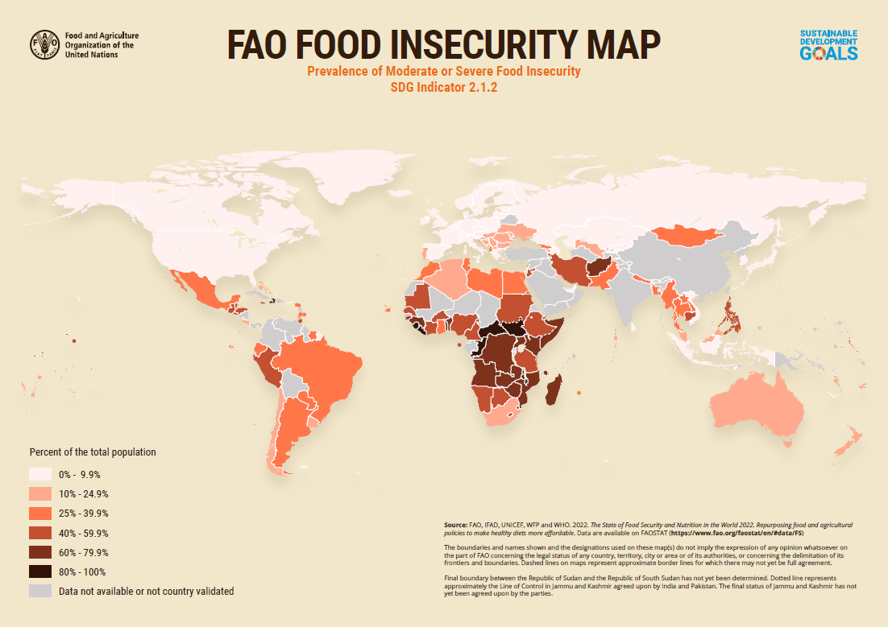
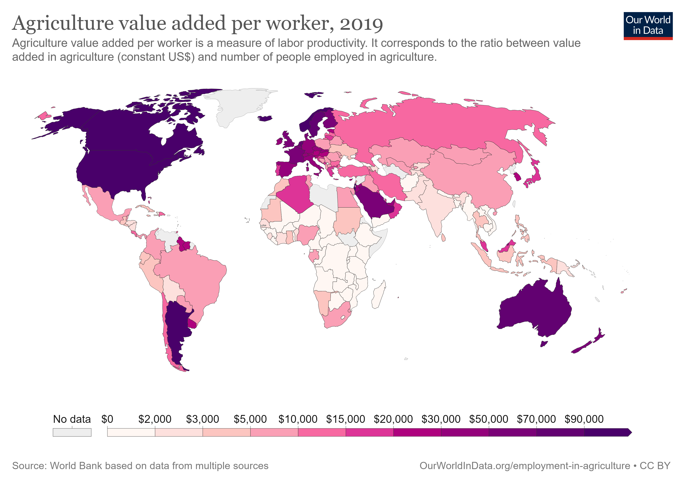

# Agri-able

## Abstract

## Inspiration

## What Agri-able Does

## Target Users

Agri-able targets the African continent, due to the following reasons:
1. **Africa is amongst the worst hit by food insecurity**, as seen in Figure 2 

Figure 2: FAO Food Insecurity Map (Food and Agriculture Organization of the United Nations, 2022)

2. **African agriculture sector is one of the least efficient**, as seen in Figure 3. Having more access to information could help them in becoming more efficient 
  

Figure 3: Agriculture value added per worker (Ritchie, 2022)

3. **Larger impact of rising food prices on lower income countries**, since a larger portion of their income is spent on food (The World Bank, 2022). Approximately 45% and 60% of total household consumption expenditure was spent on food for Uganda and Tanzania, respectively, as compared to about 15% for the US (Kavanagh, 2019). The Food and Agriculture Organization’s (FAO’S) Food Price Index rose by 55.2% between May 2020 and February 2022 (Barua, 2022). With improved crop yields from using Agri-able, it could help to lower food prices for the African community

User groups for the tool could include:
1. **Farmers**, who could access the tool fully online, without any additional investments aside from a mobile phone or computer that can access the internet
2. **African governments and agricultural ministries**, who could use the tool to better understand the existing and ideal environmental conditions for various crops, and provide necessary support to the farmers
3. **International groups** that are focussed on giving aid to the African agriculture community

## Datasets Used

## How We Built Agri-able

## Assumptions

The following lists some assumptions made based primarily on secondary research, and they can be tweaked accordingly should additional secondary or primary research states otherwise.

- Crops included in Agri-able are selected based on the following considerations:
  - Crops commonly consumed by selected population
  - Crops commonly planted by farmers in selected population
- Suggested interventions for conditions in excess or deficient are considered on an individual level, and not on a combined level
  - In reality, the soil conditions might be in excess or have deficiencies in more than one aspect. Interventions could vary based on the combinations, which would require much more in-depth research, which could include primary research.
- Weather and soil condition forecasts provided by the data sources are reliable

## Desirability, Feasibility, and Viability

Desirability, feasibility, and viability is the holy trinity for innovation. Ideas should preferably consider and meet the 3 criteria to ensure their longevity and relevancy:
- **Desirability**: One that target users really needs
- **Feasibility**: One that your organization’s capabilities are capable of supporting
- **Viability**: A profitable and sustainable business model

The following summarizes the considerations for each of the criteria, some of which have been mentioned throughout the report:

- Desirability
  - Africa is amongst the worst hit by food insecurity, and the information provided by Agri-able could help educate the African farming community to enhance their crop yields 
  - The African agriculture sector is one of the least efficient, and having more access to information could help them in becoming more efficient 
  - For lower income countries, a larger portion of their income is spent on food. The rising food prices further challenges food security for them. Improved crop yields from using Afri-able could help to keep food prices low for the African community
  - African governments, agricultural ministries, and international aid groups could use the tool to better understand existing and ideal conditions, and provide necessary support to the farmers
- Feasibility
	- Datasets are accessible from reliable sources such as AWS, Kaggle, FAO, etc. Most of the relevant data sets are kept updated, hence Agri-able can still remain relevant with time
	- The team consists of data scientists, a CX designer, and 2 product managers, who have the relevant skill sets to develop Agri-able
	- Agri-able is accessible on a desktop or mobile phone with access to the internet. No additional equipment (e.g. sensors to get condition information) is required by the users
- Viability
  - The current data sets used are open source, and no costs are required data source wise 
  - As the product expands to include other regions and features, additional free data sources from AWS, Kaggle, United Nations, FAO, etc, can be leveraged on. This keeps the cost zero for data sources

## Challenges

### Selecting and Dissecting the ASDI Datasets

There were many datasets available for this hackathon, and the first major hurdle was to analyze all of them, and pick out the relevant ones for our problem statement. Furthermore, extra effort was taken to analyze datasets with formats that the team was not familiar with. Understanding the datasets with the right context is also vital, so as to be able to translate them into actionable and reasonable insights. 

### Converting Data into Comparable Units

To be able to compare data in the same manner, conversion into a common unit was required. For example, some data was in parts per million, while others were in kg/ha. However, once the initial conversion was discovered and done, subsequent handling was seamless.

### Generalizing Soil Conditions from 30m by 30m Plots

## Accomplishments

- Building a solution that can potentially solve a huge global problem, that is also in line with 
- Reducing the granular geospatial data by merging plots of 30x30m together to improve dashboard performance

## What We Learned

## Future Work

## Conclusion

## References

Adepoju, P. (2021, November 7). Africa worst hit by climate change impacts, COP26 told. Nature. Retrieved August 26, 2022, from https://www.nature.com/articles/d44148-021-00107-z

Barua, A. (2022, May 31). Sizzling food prices are leading to global heartburn. Deloitte Insights. Retrieved August 26, 2022, from https://www2.deloitte.com/xe/en/insights/economy/global-food-prices-inflation.html

Food and Agriculture Organization of the United Nations. (2022). The state of food security and nutrition in the world 2022. Retrieved August 26, 2022, from https://www.fao.org/publications/sofi/2022/en/

Kavanagh, M. (2019, January 8). Household food spending divides the world. Financial Times. Retrieved August 26, 2022, from https://www.ft.com/content/cdd62792-0e85-11e9-acdc-4d9976f1533b

Mersie, A. (2022, April 5). Hunger in Africa surges due to conflict, climate and food prices. Reuters. Retrieved August 26, 2022, from https://www.reuters.com/world/africa/hunger-africa-surges-due-conflict-climate-food-prices-2022-04-05/

Relief Web. (2021). FAO statistical yearbook 2021 - world food and agriculture. Https://Reliefweb.Int/Report/World/Fao-Statistical-Yearbook-2021-World-Food-and-Agriculture. Retrieved August 26, 2022, from https://reliefweb.int/report/world/fao-statistical-yearbook-2021-world-food-and-agriculture

Ritchie, H. (2022, April 4). Increasing agricultural productivity across Sub-Saharan Africa is one of the most important problems this century. Our World in Data. Retrieved August 26, 2022, from https://ourworldindata.org/africa-yields-problem

The World Bank. (2022, August 15). Food Security Update. Understand Poverty - Agriculture and Food. Retrieved August 26, 2022, from https://www.worldbank.org/en/topic/agriculture/brief/food-security-update

United Nations. (n.d.). Global issues - population. Retrieved August 26, 2022, from https://www.un.org/en/global-issues/population

United Nations. (2021). The world’s food supply is made insecure by climate change. Retrieved August 26, 2022, from https://www.un.org/en/academic-impact/worlds-food-supply-made-insecure-climate-change